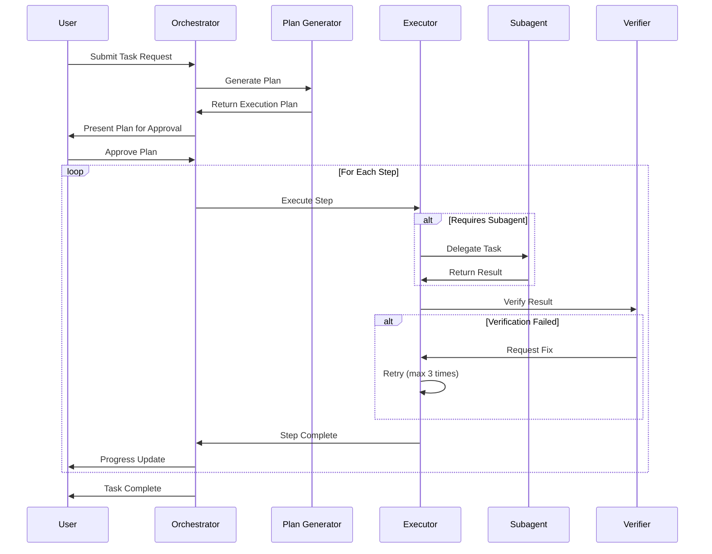
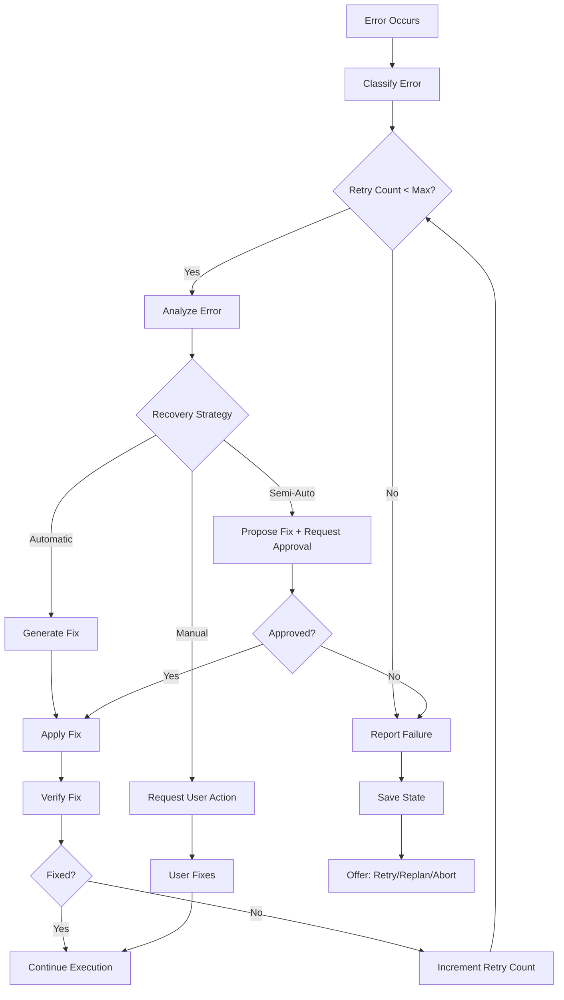

# Design Document: Complete Agentic Coding CLI

## Overview

This design document specifies the technical architecture for transforming smask-cli into a comprehensive agentic coding assistant. The system will provide autonomous multi-step development, intelligent codebase understanding, seamless git integration, multi-model support, and extensive automation capabilities while maintaining a superior developer experience.

### Design Goals

1. **Modularity**: Maintain clear separation of concerns with pluggable components
2. **Extensibility**: Support plugin system for community contributions
3. **Performance**: Handle large codebases (100k+ files) efficiently
4. **Flexibility**: Support multiple execution modes (interactive, headless, agent)
5. **Offline-First**: Enable offline operation with cloud enhancements
6. **Robustness**: Implement comprehensive error handling and recovery
7. **Testability**: Design for property-based testing
8. **Incremental Adoption**: Allow gradual feature adoption
9. **Backward Compatibility**: Maintain compatibility with existing configuration

### System Principles

- **Agent-First Architecture**: Multi-agent system with specialized subagents
- **Immutable Operations**: All file operations are previewable and reversible
- **Context-Aware**: Deep understanding of codebase structure and semantics
- **Model-Agnostic**: Unified interface supporting multiple AI providers
- **Security-Conscious**: Sandboxed execution with explicit permission model
- **Developer-Centric**: TUI optimized for keyboard-driven workflows

## Architecture

### High-Level System Architecture

```mermaid
graph TB
    CLI[CLI Entry Point] --> Orchestrator[Agent Orchestrator]
    CLI --> TUI[Terminal UI]
    
    Orchestrator --> PlanEngine[Plan Generation Engine]
    Orchestrator --> SubAgents[Specialized Subagents]
    Orchestrator --> Verification[Self-Verification System]
    
    SubAgents --> TestAgent[Testing Agent]
    SubAgents --> RefactorAgent[Refactoring Agent]
    SubAgents --> DocAgent[Documentation Agent]
    SubAgents --> SecurityAgent[Security Agent]
    SubAgents --> PerfAgent[Performance Agent]
    
    TUI --> ChatPane[Chat Pane]
    TUI --> FileTree[File Tree Pane]
    TUI --> DiffView[Diff View Pane]
    TUI --> OutputPane[Output Pane]
    
    Orchestrator --> ModelRouter[Model Router]
    ModelRouter --> OpenAI[OpenAI Provider]
    ModelRouter --> Anthropic[Anthropic Provider]
    ModelRouter --> Google[Google Provider]
    ModelRouter --> DeepSeek[DeepSeek Provider]
    ModelRouter --> Ollama[Ollama Local]
    
    Orchestrator --> CodebaseEngine[Codebase Understanding Engine]
    CodebaseEngine --> Indexer[Incremental Indexer]
    CodebaseEngine --> SemanticSearch[Semantic Search]
    CodebaseEngine --> SymbolNav[Symbol Navigation]
    CodebaseEngine --> DepGraph[Dependency Graph]
    
    Orchestrator --> FileOps[File Operations System]
    FileOps --> VFS[Virtual File System]
    FileOps --> DiffEngine[Diff Engine]
    FileOps --> Transaction[Transaction Manager]
    
    Orchestrator --> GitIntegration[Git Integration]
    GitIntegration --> CommitGen[Commit Message Generator]
    GitIntegration --> BranchMgr[Branch Manager]
    GitIntegration --> PRManager[PR Manager]
    
    Orchestrator --> TestSystem[Testing System]
    TestSystem --> TestGen[Test Generator]
    TestSystem --> TestRunner[Test Runner]
    TestSystem --> Coverage[Coverage Analyzer]
    
    Orchestrator --> Security[Security System]
    Security --> Sandbox[Sandbox Environment]
    Security --> Permissions[Permission Manager]
    Security --> Encryption[API Key Encryption]
    
    Orchestrator --> Extensions[Extension System]
    Extensions --> PluginLoader[Plugin Loader]
    Extensions --> SkillRegistry[Skill Registry]
    Extensions --> HookManager[Hook Manager]
    Extensions --> MCPClient[MCP Client]
```



### Core Components


#### 1. Agent Orchestrator

The central coordinator managing task execution, subagent delegation, and state management.

**Responsibilities:**
- Parse high-level user requests into executable plans
- Delegate tasks to specialized subagents
- Manage execution state and context
- Coordinate multi-step workflows
- Handle error recovery and retry logic
- Enforce iteration limits to prevent infinite loops

**Key Interfaces:**
```typescript
interface AgentOrchestrator {
  executeTask(request: TaskRequest): Promise<TaskResult>;
  generatePlan(request: TaskRequest): ExecutionPlan;
  delegateToSubagent(task: SubTask, agent: SubagentType): Promise<SubTaskResult>;
  verifyResult(result: TaskResult): VerificationResult;
  recoverFromError(error: ExecutionError): RecoveryAction;
}

interface ExecutionPlan {
  steps: PlanStep[];
  dependencies: Map<string, string[]>;
  estimatedTime: number;
  complexity: ComplexityLevel;
}

interface PlanStep {
  id: string;
  description: string;
  action: ActionType;
  dependencies: string[];
  estimatedDuration: number;
  requiresApproval: boolean;
}
```

#### 2. Model Router

Unified interface for all AI model providers with intelligent routing and context management.

**Responsibilities:**
- Abstract provider-specific APIs
- Handle streaming responses
- Manage context windows and token budgets
- Implement rate limiting and retry logic
- Support model switching without context loss
- Optimize token usage through compression

**Key Interfaces:**
```typescript
interface ModelRouter {
  sendMessage(message: Message, options: ModelOptions): AsyncIterator<MessageChunk>;
  switchModel(newModel: ModelConfig): void;
  getTokenUsage(): TokenUsage;
  optimizeContext(context: Context): OptimizedContext;
}


interface ModelProvider {
  name: string;
  models: ModelConfig[];
  supportsStreaming: boolean;
  supportsVision: boolean;
  maxContextWindow: number;
  
  sendRequest(request: ModelRequest): AsyncIterator<ModelResponse>;
  estimateTokens(text: string): number;
  handleRateLimit(error: RateLimitError): Promise<void>;
}

interface TokenUsage {
  used: number;
  remaining: number;
  total: number;
  percentage: number;
}
```

#### 3. Codebase Understanding Engine

Comprehensive system for indexing, searching, and navigating codebases.

**Responsibilities:**
- Incremental indexing of source files
- Symbol extraction (functions, classes, variables, types)
- Dependency graph construction
- Semantic search with embeddings
- Symbol navigation (go-to-definition, find-references)
- Language-specific parsing

**Key Interfaces:**
```typescript
interface CodebaseEngine {
  index(paths: string[]): Promise<IndexResult>;
  search(query: SearchQuery): Promise<SearchResult[]>;
  findSymbol(name: string): Promise<Symbol[]>;
  findReferences(symbol: Symbol): Promise<Reference[]>;
  getDependencyGraph(): DependencyGraph;
  updateIncremental(changes: FileChange[]): Promise<void>;
}

interface IndexResult {
  filesIndexed: number;
  symbolsExtracted: number;
  duration: number;
  errors: IndexError[];
}

interface Symbol {
  name: string;
  kind: SymbolKind;
  location: Location;
  signature: string;
  documentation?: string;
}


interface DependencyGraph {
  nodes: Map<string, ModuleNode>;
  edges: DependencyEdge[];
  detectCycles(): CyclicDependency[];
  findUnused(): string[];
  getCriticalPath(): string[];
}
```

#### 4. File Operations System

Virtual file system with atomic transactions, diff generation, and rollback capabilities.

**Responsibilities:**
- Virtual file system for preview/rollback
- Atomic multi-file transactions
- Diff generation and visualization
- Selective apply with conflict resolution
- File watching for incremental updates

**Key Interfaces:**
```typescript
interface FileOperationsSystem {
  createTransaction(): Transaction;
  previewChanges(transaction: Transaction): Diff[];
  applyChanges(transaction: Transaction, selective?: SelectiveApply): Promise<ApplyResult>;
  rollback(transactionId: string): Promise<void>;
  watchFiles(patterns: string[]): FileWatcher;
}

interface Transaction {
  id: string;
  operations: FileOperation[];
  state: TransactionState;
  
  addOperation(op: FileOperation): void;
  commit(): Promise<void>;
  rollback(): Promise<void>;
}

interface FileOperation {
  type: 'create' | 'modify' | 'delete' | 'move';
  path: string;
  content?: string;
  newPath?: string;
}

interface Diff {
  path: string;
  hunks: DiffHunk[];
  additions: number;
  deletions: number;
}

interface DiffHunk {
  oldStart: number;
  oldLines: number;
  newStart: number;
  newLines: number;
  lines: DiffLine[];
}
```


#### 5. Git Integration

Seamless git operations with automatic commit generation and branch management.

**Responsibilities:**
- Git operation abstraction
- Commit message generation
- Branch management
- PR creation and management
- Conflict detection and resolution

**Key Interfaces:**
```typescript
interface GitIntegration {
  createCommit(changes: FileChange[], message?: string): Promise<Commit>;
  generateCommitMessage(changes: FileChange[]): Promise<string>;
  createBranch(name: string, from?: string): Promise<Branch>;
  createPullRequest(options: PROptions): Promise<PullRequest>;
  detectConflicts(): Promise<Conflict[]>;
  resolveConflict(conflict: Conflict, resolution: Resolution): Promise<void>;
}

interface Commit {
  hash: string;
  message: string;
  author: string;
  timestamp: Date;
  files: string[];
}

interface PROptions {
  title: string;
  description: string;
  base: string;
  head: string;
  labels?: string[];
  reviewers?: string[];
}
```

#### 6. Testing System

Automated test generation, execution, and coverage analysis.

**Responsibilities:**
- Generate unit tests, edge case tests, and property-based tests
- Execute tests with multiple frameworks
- Analyze test failures and suggest fixes
- Track code coverage
- Support framework adapters

**Key Interfaces:**
```typescript
interface TestingSystem {
  generateTests(code: CodeUnit, options: TestGenOptions): Promise<Test[]>;
  runTests(tests: Test[]): Promise<TestResult[]>;
  analyzeCoverage(results: TestResult[]): CoverageReport;
  suggestFixes(failures: TestFailure[]): Promise<Fix[]>;
}


interface TestGenOptions {
  framework: TestFramework;
  includeEdgeCases: boolean;
  includePropertyTests: boolean;
  coverageTarget: number;
}

interface Test {
  name: string;
  type: 'unit' | 'integration' | 'property' | 'edge-case';
  code: string;
  framework: TestFramework;
}

interface TestResult {
  test: Test;
  passed: boolean;
  duration: number;
  error?: Error;
  coverage?: number;
}
```

#### 7. Security System

Sandboxed execution, permission management, and API key encryption.

**Responsibilities:**
- Docker-based sandboxed execution
- Permission approval workflows
- API key encryption at rest
- Privacy mode implementation
- Audit logging

**Key Interfaces:**
```typescript
interface SecuritySystem {
  executeSandboxed(code: string, options: SandboxOptions): Promise<ExecutionResult>;
  requestPermission(operation: Operation): Promise<PermissionResult>;
  encryptApiKey(key: string): Promise<EncryptedKey>;
  decryptApiKey(encrypted: EncryptedKey): Promise<string>;
  enablePrivacyMode(): void;
  auditLog(event: AuditEvent): void;
}

interface SandboxOptions {
  runtime: Runtime;
  cpuLimit: number;
  memoryLimit: number;
  timeoutSeconds: number;
  networkAccess: NetworkPolicy;
  volumeMounts: VolumeMount[];
}

interface PermissionResult {
  granted: boolean;
  remember: boolean;
  reason?: string;
}
```


#### 8. Extension System

Plugin architecture with skills, hooks, and MCP integration.

**Responsibilities:**
- Load and manage plugins
- Register and execute skills
- Manage lifecycle hooks
- MCP protocol implementation
- Plugin sandboxing

**Key Interfaces:**
```typescript
interface ExtensionSystem {
  loadPlugin(path: string): Promise<Plugin>;
  registerSkill(skill: Skill): void;
  registerHook(hook: Hook): void;
  connectMCP(server: MCPServer): Promise<MCPConnection>;
  executeSkill(name: string, params: any): Promise<any>;
  triggerHook(event: HookEvent): Promise<void>;
}

interface Plugin {
  manifest: PluginManifest;
  onLoad(): Promise<void>;
  onUnload(): Promise<void>;
  onMessage(message: Message): Promise<void>;
}

interface Skill {
  name: string;
  description: string;
  parameters: ParameterSchema;
  execute(params: any, context: ExecutionContext): Promise<SkillResult>;
}

interface Hook {
  event: HookEvent;
  condition?: (context: HookContext) => boolean;
  action: (context: HookContext) => Promise<void>;
  priority: number;
}
```

#### 9. Terminal UI (TUI)

React-based terminal interface with multiple panes and vim-style navigation.

**Responsibilities:**
- Multi-pane layout management
- Vim-style keyboard navigation
- Syntax highlighting
- Streaming response display
- File tree visualization
- Diff view rendering

**Key Components:**
```typescript
interface TUIComponents {
  ChatPane: React.FC<ChatPaneProps>;
  FileTreePane: React.FC<FileTreeProps>;
  DiffViewPane: React.FC<DiffViewProps>;
  OutputPane: React.FC<OutputProps>;
  StatusBar: React.FC<StatusBarProps>;
  CommandPalette: React.FC<CommandPaletteProps>;
}
```


## Data Models

### Core Data Structures

#### Configuration

```typescript
interface Configuration {
  version: string;
  profiles: Map<string, Profile>;
  activeProfile: string;
  project?: ProjectConfig;
  global: GlobalConfig;
}

interface Profile {
  name: string;
  models: ModelPreferences;
  approval: ApprovalSettings;
  privacy: PrivacySettings;
  ui: UISettings;
}

interface ProjectConfig {
  instructions: string;
  conventions: CodingConventions;
  preferredModels: ModelPreferences;
  customCommands: SlashCommand[];
  ignorePatterns: string[];
  skills: Skill[];
  hooks: Hook[];
  templates: Template[];
}

interface GlobalConfig {
  apiKeys: Map<string, EncryptedKey>;
  telemetry: TelemetrySettings;
  updateChannel: 'stable' | 'beta';
  offlineModels: string[];
}
```

#### Session State

```typescript
interface Session {
  id: string;
  name?: string;
  created: Date;
  lastModified: Date;
  mode: ChatMode;
  model: ModelConfig;
  messages: Message[];
  context: SessionContext;
  undoStack: Operation[];
  redoStack: Operation[];
}

interface SessionContext {
  workingDirectory: string;
  openFiles: string[];
  codebaseIndex: IndexSnapshot;
  activeTransaction?: Transaction;
  pinnedMessages: string[];
}
```


#### Codebase Index

```typescript
interface CodebaseIndex {
  version: number;
  timestamp: Date;
  files: Map<string, FileMetadata>;
  symbols: Map<string, Symbol[]>;
  dependencies: DependencyGraph;
  embeddings: Map<string, Embedding>;
}

interface FileMetadata {
  path: string;
  language: Language;
  size: number;
  lastModified: Date;
  hash: string;
  symbols: Symbol[];
  imports: Import[];
}

interface Embedding {
  vector: number[];
  model: string;
  timestamp: Date;
}
```

#### Execution Plan

```typescript
interface ExecutionPlan {
  id: string;
  goal: string;
  steps: PlanStep[];
  dependencies: Map<string, string[]>;
  estimatedTime: number;
  complexity: ComplexityLevel;
  status: PlanStatus;
  currentStep?: string;
  results: Map<string, StepResult>;
}

interface StepResult {
  stepId: string;
  status: 'pending' | 'running' | 'completed' | 'failed' | 'skipped';
  startTime?: Date;
  endTime?: Date;
  output?: any;
  error?: Error;
  retryCount: number;
}
```

## Components and Interfaces

### Agent Orchestrator Implementation

The Agent Orchestrator is the central brain of the system, coordinating all operations.

**Architecture:**
```
AgentOrchestrator
├── PlanGenerator: Creates execution plans from user requests
├── TaskExecutor: Executes plan steps
├── SubagentManager: Manages specialized subagents
├── StateManager: Tracks execution state
└── ErrorRecovery: Handles failures and retries
```


**Workflow Sequence:**



**Key Algorithms:**

1. **Plan Generation Algorithm:**
```
function generatePlan(request: TaskRequest): ExecutionPlan {
  1. Analyze request to identify required capabilities
  2. Break down into atomic steps
  3. Identify dependencies between steps
  4. Estimate complexity and duration
  5. Determine which steps require approval
  6. Assign steps to appropriate subagents
  7. Return structured plan
}
```

2. **Error Recovery Algorithm:**
```
function recoverFromError(error: ExecutionError, step: PlanStep): RecoveryAction {
  1. Classify error type (syntax, runtime, logic, external)
  2. Check retry count (max 3 attempts)
  3. If retryable and under limit:
     - Analyze error message
     - Generate fix strategy
     - Apply fix
     - Retry step
  4. If not retryable or limit exceeded:
     - Mark step as failed
     - Offer to replan or abort
  5. Return recovery action
}
```


### Model Router Implementation

The Model Router provides a unified interface to all AI providers.

**Provider Adapters:**
```
ModelRouter
├── OpenAIAdapter: GPT-4, GPT-4 Turbo, o1, o3-mini
├── AnthropicAdapter: Claude 3.7 Sonnet, Claude 3.5 Sonnet, Claude 3 Opus
├── GoogleAdapter: Gemini 2.0 Flash, Gemini 1.5 Pro
├── DeepSeekAdapter: DeepSeek R1, DeepSeek Chat V3
└── OllamaAdapter: Local models
```

**Context Management Strategy:**

```typescript
class ContextManager {
  private maxTokens: number;
  private currentUsage: number;
  private messages: Message[];
  private pinnedMessages: Set<string>;
  
  optimizeContext(): OptimizedContext {
    // 1. Calculate available space
    const available = this.maxTokens - this.currentUsage;
    
    // 2. Always include pinned messages
    const pinned = this.messages.filter(m => this.pinnedMessages.has(m.id));
    
    // 3. Include recent messages (last 10)
    const recent = this.messages.slice(-10);
    
    // 4. Use embeddings to select most relevant older messages
    const relevant = this.selectRelevantMessages(available);
    
    // 5. Summarize very old messages if needed
    const summarized = this.summarizeOldMessages();
    
    return {
      messages: [...pinned, ...summarized, ...relevant, ...recent],
      tokensUsed: this.estimateTokens([...pinned, ...summarized, ...relevant, ...recent])
    };
  }
  
  selectRelevantMessages(tokenBudget: number): Message[] {
    // Use cosine similarity with current context to select most relevant
    const currentEmbedding = this.embedCurrentContext();
    const scored = this.messages.map(m => ({
      message: m,
      score: cosineSimilarity(currentEmbedding, m.embedding)
    }));
    
    // Sort by relevance and fit within budget
    scored.sort((a, b) => b.score - a.score);
    const selected: Message[] = [];
    let used = 0;
    
    for (const item of scored) {
      const tokens = this.estimateTokens([item.message]);
      if (used + tokens <= tokenBudget) {
        selected.push(item.message);
        used += tokens;
      }
    }
    
    return selected;
  }
}
```


### Codebase Understanding Engine Implementation

**Indexing Strategy:**

```typescript
class IncrementalIndexer {
  private index: CodebaseIndex;
  private watcher: FileWatcher;
  
  async indexRepository(root: string): Promise<IndexResult> {
    // 1. Discover all source files (respect .gitignore, .smaskignore)
    const files = await this.discoverFiles(root);
    
    // 2. Process files in parallel (batches of 100)
    const batches = chunk(files, 100);
    const results = await Promise.all(
      batches.map(batch => this.processBatch(batch))
    );
    
    // 3. Build dependency graph
    await this.buildDependencyGraph();
    
    // 4. Generate embeddings for semantic search
    await this.generateEmbeddings();
    
    // 5. Setup file watcher for incremental updates
    this.setupWatcher(root);
    
    return this.aggregateResults(results);
  }
  
  async processBatch(files: string[]): Promise<BatchResult> {
    return Promise.all(files.map(async file => {
      // Parse file based on language
      const parser = this.getParser(file);
      const ast = await parser.parse(file);
      
      // Extract symbols
      const symbols = this.extractSymbols(ast);
      
      // Extract imports/dependencies
      const imports = this.extractImports(ast);
      
      // Store in index
      this.index.files.set(file, {
        path: file,
        language: parser.language,
        symbols,
        imports,
        hash: await this.hashFile(file),
        lastModified: new Date()
      });
      
      return { file, symbolCount: symbols.length };
    }));
  }
  
  async updateIncremental(changes: FileChange[]): Promise<void> {
    for (const change of changes) {
      if (change.type === 'delete') {
        this.index.files.delete(change.path);
      } else {
        // Re-index only changed file
        await this.processBatch([change.path]);
      }
    }
    
    // Update dependency graph incrementally
    await this.updateDependencyGraph(changes);
  }
}
```


**Semantic Search Implementation:**

```typescript
class SemanticSearch {
  private embeddings: Map<string, Embedding>;
  private embeddingModel: EmbeddingModel;
  
  async search(query: string, options: SearchOptions): Promise<SearchResult[]> {
    // 1. Generate embedding for query
    const queryEmbedding = await this.embeddingModel.embed(query);
    
    // 2. Calculate similarity with all indexed items
    const scored: ScoredResult[] = [];
    for (const [key, embedding] of this.embeddings) {
      const similarity = cosineSimilarity(queryEmbedding, embedding.vector);
      if (similarity > options.threshold) {
        scored.push({ key, similarity });
      }
    }
    
    // 3. Sort by similarity
    scored.sort((a, b) => b.similarity - a.similarity);
    
    // 4. Apply filters (file type, directory, date)
    const filtered = this.applyFilters(scored, options.filters);
    
    // 5. Return top N results
    return filtered.slice(0, options.limit).map(r => ({
      path: r.key,
      similarity: r.similarity,
      content: this.getContent(r.key)
    }));
  }
}
```

**Dependency Graph Construction:**

```typescript
class DependencyGraphBuilder {
  buildGraph(index: CodebaseIndex): DependencyGraph {
    const graph: DependencyGraph = {
      nodes: new Map(),
      edges: []
    };
    
    // 1. Create nodes for all files
    for (const [path, metadata] of index.files) {
      graph.nodes.set(path, {
        path,
        imports: metadata.imports,
        exports: this.extractExports(metadata)
      });
    }
    
    // 2. Create edges for dependencies
    for (const [path, node] of graph.nodes) {
      for (const imp of node.imports) {
        const resolvedPath = this.resolveImport(imp, path);
        if (resolvedPath && graph.nodes.has(resolvedPath)) {
          graph.edges.push({
            from: path,
            to: resolvedPath,
            type: imp.type
          });
        }
      }
    }
    
    return graph;
  }
  
  detectCycles(graph: DependencyGraph): CyclicDependency[] {
    // Use Tarjan's algorithm for cycle detection
    const cycles: CyclicDependency[] = [];
    const visited = new Set<string>();
    const stack = new Set<string>();
    
    const dfs = (node: string, path: string[]) => {
      if (stack.has(node)) {
        // Found cycle
        const cycleStart = path.indexOf(node);
        cycles.push({
          nodes: path.slice(cycleStart),
          severity: 'error'
        });
        return;
      }
      
      if (visited.has(node)) return;
      
      visited.add(node);
      stack.add(node);
      path.push(node);
      
      const edges = graph.edges.filter(e => e.from === node);
      for (const edge of edges) {
        dfs(edge.to, [...path]);
      }
      
      stack.delete(node);
    };
    
    for (const node of graph.nodes.keys()) {
      if (!visited.has(node)) {
        dfs(node, []);
      }
    }
    
    return cycles;
  }
}
```


### File Operations System Implementation

**Virtual File System:**

```typescript
class VirtualFileSystem {
  private snapshots: Map<string, FileSnapshot>;
  private currentTransaction?: Transaction;
  
  createTransaction(): Transaction {
    return {
      id: generateId(),
      operations: [],
      state: 'pending',
      snapshot: this.createSnapshot(),
      
      addOperation(op: FileOperation) {
        this.operations.push(op);
      },
      
      async commit() {
        try {
          // Apply all operations atomically
          for (const op of this.operations) {
            await this.applyOperation(op);
          }
          this.state = 'committed';
        } catch (error) {
          // Rollback on any failure
          await this.rollback();
          throw error;
        }
      },
      
      async rollback() {
        // Restore from snapshot
        await this.restoreSnapshot(this.snapshot);
        this.state = 'rolled-back';
      }
    };
  }
  
  private createSnapshot(): FileSnapshot {
    // Create snapshot of current file system state
    const snapshot: FileSnapshot = {
      timestamp: new Date(),
      files: new Map()
    };
    
    for (const [path, content] of this.files) {
      snapshot.files.set(path, {
        content,
        hash: this.hashContent(content),
        metadata: this.getMetadata(path)
      });
    }
    
    return snapshot;
  }
}
```

**Diff Engine:**

```typescript
class DiffEngine {
  generateDiff(original: string, modified: string): Diff {
    // Use Myers diff algorithm
    const lines1 = original.split('\n');
    const lines2 = modified.split('\n');
    
    const diff = myersDiff(lines1, lines2);
    const hunks = this.groupIntoHunks(diff);
    
    return {
      path: '',
      hunks,
      additions: this.countAdditions(hunks),
      deletions: this.countDeletions(hunks)
    };
  }
  
  private groupIntoHunks(diff: DiffLine[]): DiffHunk[] {
    const hunks: DiffHunk[] = [];
    let currentHunk: DiffLine[] = [];
    let contextLines = 0;
    
    for (const line of diff) {
      if (line.type === 'context') {
        contextLines++;
        if (contextLines > 3 && currentHunk.length > 0) {
          // Start new hunk
          hunks.push(this.createHunk(currentHunk));
          currentHunk = [];
          contextLines = 0;
        }
      } else {
        contextLines = 0;
      }
      currentHunk.push(line);
    }
    
    if (currentHunk.length > 0) {
      hunks.push(this.createHunk(currentHunk));
    }
    
    return hunks;
  }
}
```


### Testing System Implementation

**Test Generator:**

```typescript
class TestGenerator {
  async generateTests(code: CodeUnit, options: TestGenOptions): Promise<Test[]> {
    const tests: Test[] = [];
    
    // 1. Generate unit tests for main functionality
    const unitTests = await this.generateUnitTests(code, options);
    tests.push(...unitTests);
    
    // 2. Generate edge case tests
    if (options.includeEdgeCases) {
      const edgeCaseTests = await this.generateEdgeCaseTests(code);
      tests.push(...edgeCaseTests);
    }
    
    // 3. Generate property-based tests
    if (options.includePropertyTests) {
      const propertyTests = await this.generatePropertyTests(code);
      tests.push(...propertyTests);
    }
    
    return tests;
  }
  
  private async generatePropertyTests(code: CodeUnit): Promise<Test[]> {
    // Identify properties from function signatures and behavior
    const properties = this.identifyProperties(code);
    
    return properties.map(prop => ({
      name: `property_${prop.name}`,
      type: 'property',
      code: this.generatePropertyTestCode(prop, code),
      framework: 'fast-check' // or jsverify, hypothesis, etc.
    }));
  }
  
  private identifyProperties(code: CodeUnit): Property[] {
    const properties: Property[] = [];
    
    // Look for round-trip opportunities (serialize/deserialize, encode/decode)
    if (this.hasInverseFunctions(code)) {
      properties.push({
        name: 'round_trip',
        type: 'round-trip',
        description: 'Applying function then inverse should return original'
      });
    }
    
    // Look for invariants (properties that don't change)
    const invariants = this.detectInvariants(code);
    properties.push(...invariants);
    
    // Look for idempotent operations
    if (this.isIdempotent(code)) {
      properties.push({
        name: 'idempotence',
        type: 'idempotence',
        description: 'Applying operation twice equals applying once'
      });
    }
    
    return properties;
  }
}
```


### Security System Implementation

**Sandbox Environment:**

```typescript
class SandboxEnvironment {
  async executeSandboxed(code: string, options: SandboxOptions): Promise<ExecutionResult> {
    // 1. Create Docker container with constraints
    const container = await this.createContainer({
      image: this.getRuntimeImage(options.runtime),
      cpuLimit: options.cpuLimit,
      memoryLimit: options.memoryLimit,
      networkMode: this.getNetworkMode(options.networkAccess),
      volumeMounts: options.volumeMounts
    });
    
    try {
      // 2. Copy code into container
      await container.copyFile('/workspace/code', code);
      
      // 3. Execute with timeout
      const result = await Promise.race([
        container.exec(this.getExecuteCommand(options.runtime)),
        this.timeout(options.timeoutSeconds * 1000)
      ]);
      
      // 4. Collect output
      return {
        stdout: result.stdout,
        stderr: result.stderr,
        exitCode: result.exitCode,
        duration: result.duration
      };
    } finally {
      // 5. Always cleanup container
      await container.remove();
    }
  }
  
  private getNetworkMode(policy: NetworkPolicy): string {
    switch (policy) {
      case 'none': return 'none';
      case 'restricted': return 'bridge'; // with firewall rules
      case 'full': return 'bridge';
    }
  }
}
```

**Permission Manager:**

```typescript
class PermissionManager {
  private rules: Map<OperationType, PermissionRule>;
  private auditLog: AuditEvent[] = [];
  
  async requestPermission(operation: Operation): Promise<PermissionResult> {
    // 1. Check if there's a stored rule
    const rule = this.rules.get(operation.type);
    if (rule) {
      if (rule.action === 'always-allow') {
        this.auditLog.push({ operation, result: 'granted', timestamp: new Date() });
        return { granted: true, remember: false };
      }
      if (rule.action === 'always-deny') {
        this.auditLog.push({ operation, result: 'denied', timestamp: new Date() });
        return { granted: false, remember: false };
      }
    }
    
    // 2. Prompt user for approval
    const response = await this.promptUser({
      operation,
      description: this.describeOperation(operation),
      options: ['Allow', 'Deny', 'Always Allow', 'Always Deny']
    });
    
    // 3. Store rule if requested
    if (response.remember) {
      this.rules.set(operation.type, {
        action: response.granted ? 'always-allow' : 'always-deny',
        createdAt: new Date()
      });
    }
    
    // 4. Log decision
    this.auditLog.push({
      operation,
      result: response.granted ? 'granted' : 'denied',
      timestamp: new Date(),
      remember: response.remember
    });
    
    return response;
  }
}
```


## Correctness Properties

*A property is a characteristic or behavior that should hold true across all valid executions of a system—essentially, a formal statement about what the system should do. Properties serve as the bridge between human-readable specifications and machine-verifiable correctness guarantees.*

### Property Reflection

After analyzing all 60 requirements, I identified 47 testable properties. Through reflection, I've consolidated redundant properties:

**Consolidations Made:**
- Properties 4.9 and 28.11 (symbol navigation correctness) → Combined into single comprehensive property
- Properties 11.11 and 7.11 (context preservation on switches) → Combined into single property covering both model and mode switches
- Properties 57.9 and 57.10 (configuration round-trip) → Combined as 57.10 subsumes 57.9
- Property 22.11 corrected: encryption round-trip should test decrypt(encrypt(x)) == x, not ciphertext equality

**Properties Excluded:**
- Subjective quality metrics (accuracy of commit messages, documentation, review suggestions)
- Performance requirements (test execution time)
- Meta-properties (tests verifying tests)
- Properties requiring manual verification (help content accuracy, syntax highlighting correctness)

This leaves 42 unique, testable properties organized by category below.

### Agent Orchestration Properties

#### Property 1: Plan Generation Completeness

*For any* high-level task description, the Agent_Mode SHALL generate an execution plan containing steps, dependencies, time estimates, and complexity assessment.

**Validates: Requirements 1.1**

#### Property 2: Sequential Step Execution with Verification

*For any* execution plan, each step SHALL be executed in dependency order and verification SHALL complete successfully before proceeding to the next step.

**Validates: Requirements 1.2**

#### Property 3: Automatic Error Recovery

*For any* execution error, the Agent_Mode SHALL attempt diagnosis and recovery before failing the step.

**Validates: Requirements 1.3**

#### Property 4: Iteration Limit Enforcement

*For any* error during execution, the retry count SHALL never exceed 10 attempts per error.

**Validates: Requirements 1.7**

#### Property 5: Plan Execution Completeness

*For any* completed task execution, verifying the result SHALL confirm all acceptance criteria from the original request are met.

**Validates: Requirements 1.8**


### File Operations Properties

#### Property 6: Syntactic Correctness Preservation

*For any* multi-file edit operation, all modified files SHALL remain syntactically valid after changes are applied.

**Validates: Requirements 2.4**

#### Property 7: Atomic Transaction Execution

*For any* multi-file transaction, either all file operations SHALL succeed or all SHALL be rolled back, with no partial application.

**Validates: Requirements 2.6**

#### Property 8: Diff Completeness Invariant

*For any* multi-file edit, the sum of additions and deletions across all individual file diffs SHALL equal the total shown in the unified diff.

**Validates: Requirements 2.8**

#### Property 9: Change Application Idempotence

*For any* set of changes, applying then reverting then applying again SHALL produce identical file states.

**Validates: Requirements 3.8**

### Codebase Understanding Properties

#### Property 10: Symbol Navigation Correctness

*For any* symbol in the codebase index, searching for the symbol then navigating to its definition SHALL locate the correct declaration location.

**Validates: Requirements 4.9, 28.11**

#### Property 11: Dependency Graph Accuracy

*For any* edge in the dependency graph, there SHALL exist a corresponding import/require statement in the source code.

**Validates: Requirements 29.10**

### Model Integration Properties

#### Property 12: Context Preservation on Switches

*For any* model switch or mode switch during a session, the conversation context and history SHALL be preserved without loss.

**Validates: Requirements 7.11, 11.11**

#### Property 13: Token Limit Invariant

*For any* context management operation, the total token count SHALL never exceed the active model's maximum context window.

**Validates: Requirements 33.11**


### Code Quality Properties

#### Property 14: Semantic Preservation in Auto-Fixes

*For any* auto-fix applied to code, running the test suite before and after SHALL produce identical results, confirming behavior is unchanged.

**Validates: Requirements 8.9**

#### Property 15: Semantic Preservation in Refactoring

*For any* refactoring operation, the test suite SHALL pass both before and after the refactoring, confirming behavioral equivalence.

**Validates: Requirements 43.11**

#### Property 16: Auto-Fix Error Resolution

*For any* auto-fix applied to resolve an error, the fixed code SHALL compile and run without the original error.

**Validates: Requirements 30.11**

### Security Properties

#### Property 17: Content Sanitization

*For any* URL fetched, the extracted content SHALL have all script tags, tracking pixels, and executable code removed.

**Validates: Requirements 10.10**

#### Property 18: Sandbox Isolation

*For any* code executed in the sandbox environment, failures or malicious behavior SHALL not affect the host system state.

**Validates: Requirements 15.10**

#### Property 19: Permission Denial Safety

*For any* operation that requires approval, denying the permission SHALL leave the system state completely unchanged.

**Validates: Requirements 14.11**

#### Property 20: Privacy Data Exclusion

*For any* telemetry data collected, scanning the data SHALL find no personally identifiable information (names, emails, file paths, code content).

**Validates: Requirements 53.11**

### Data Persistence Properties

#### Property 21: Session Persistence Idempotence

*For any* session, saving then loading then saving again SHALL produce identical session state.

**Validates: Requirements 12.11**

#### Property 22: Configuration Round-Trip

*For any* valid configuration object, parsing from file then pretty-printing then parsing again SHALL produce an equivalent configuration object.

**Validates: Requirements 13.11, 57.9, 57.10**


#### Property 23: Encryption Round-Trip

*For any* plaintext API key, encrypting then decrypting SHALL return the original plaintext (note: ciphertext will differ due to IV/nonce).

**Validates: Requirements 22.11 (corrected)**

#### Property 24: Undo-Redo Round-Trip

*For any* file operation, undoing then redoing SHALL restore the exact original state.

**Validates: Requirements 40.11**

#### Property 25: Configuration Validity

*For any* syntactically valid configuration file, loading the configuration SHALL complete without errors.

**Validates: Requirements 56.11**

### Extension System Properties

#### Property 26: Plugin Lifecycle Idempotence

*For any* loaded plugin, unloading then reloading SHALL restore full plugin functionality.

**Validates: Requirements 16.11**

#### Property 27: Hook Execution Order

*For any* set of configured hooks for an event, the execution order SHALL match the configuration order (respecting priority).

**Validates: Requirements 18.12**

#### Property 28: MCP Protocol Conformance

*For any* MCP tool invocation, both the request and response SHALL validate against the MCP protocol specification schema.

**Validates: Requirements 20.11**

### Integration Properties

#### Property 29: GitHub Rate Limit Resilience

*For any* GitHub API call that encounters rate limiting, the system SHALL implement exponential backoff and eventually succeed or timeout gracefully.

**Validates: Requirements 21.13**

#### Property 30: Issue Tracker Synchronization

*For any* issue operation (create, update, comment), the changes SHALL be reflected in the external issue tracker within the operation timeout.

**Validates: Requirements 37.13**

#### Property 31: Pipeline Parameter Correctness

*For any* CI/CD pipeline trigger with specified parameters, the executed pipeline SHALL use exactly those parameters.

**Validates: Requirements 38.12**


### Execution Mode Properties

#### Property 32: Headless Exit Code Accuracy

*For any* headless execution, the exit code SHALL be 0 if and only if the operation completed successfully.

**Validates: Requirements 23.11**

#### Property 33: Self-Verification Termination

*For any* self-verification cycle, the process SHALL terminate within the maximum iteration limit, either with all checks passing or with unfixable issues reported.

**Validates: Requirements 32.10**

### UI and Navigation Properties

#### Property 34: Slash Command Uniqueness

*For any* two slash commands in the system, they SHALL have different command names (no collisions).

**Validates: Requirements 24.21**

#### Property 35: Navigation State Consistency

*For any* navigation command (vim-style or otherwise), the cursor position SHALL update to match the command's intended destination.

**Validates: Requirements 25.15**

#### Property 36: File Tree Consistency

*For any* file tree display, the shown directory structure SHALL exactly match the actual filesystem structure (respecting ignore patterns).

**Validates: Requirements 26.12**

#### Property 37: Clipboard Round-Trip

*For any* content, copying to clipboard then pasting SHALL preserve the exact content.

**Validates: Requirements 34.9**

#### Property 38: Streaming Response Consistency

*For any* streaming model response, the final displayed content SHALL exactly match the complete response when fully received.

**Validates: Requirements 47.10**

### Batch Operations Properties

#### Property 39: Batch Operation Completeness

*For any* batch file operation with a glob pattern, the number of files processed SHALL equal the number of files matched by the pattern.

**Validates: Requirements 48.11**

#### Property 40: Template Structural Correctness

*For any* template expansion, the output SHALL contain all required sections and follow the template's structural definition.

**Validates: Requirements 49.11**


### Cross-Cutting Properties

#### Property 41: Profile Consistency

*For any* profile switch, all active settings (model preferences, approval rules, privacy settings) SHALL match the selected profile's configuration.

**Validates: Requirements 35.11**

#### Property 42: Terminal Compatibility

*For any* core CLI functionality, the behavior SHALL be identical whether running in a terminal multiplexer (tmux/screen) or directly.

**Validates: Requirements 36.9**

#### Property 43: Session Sharing Consistency

*For any* shared session, the recipient SHALL see the same conversation context, messages, and state as the sender.

**Validates: Requirements 50.11**

#### Property 44: Offline-Online Feature Parity

*For any* operation supported in offline mode, the functionality and results SHALL match online mode behavior (excluding network-dependent features).

**Validates: Requirements 51.11**

#### Property 45: Accessibility Feature Parity

*For any* core functionality, the behavior in accessibility mode SHALL be equivalent to standard mode.

**Validates: Requirements 52.11**

#### Property 46: Backward Compatibility

*For any* configuration file from a previous version, loading it in a new version SHALL succeed without errors (with automatic migration if needed).

**Validates: Requirements 54.11**

#### Property 47: Code Completion Validity

*For any* completion suggestion in a given context, the suggested item SHALL be syntactically and semantically valid in that context.

**Validates: Requirements 58.11**

#### Property 48: Cross-Platform Feature Parity

*For any* core functionality, the behavior SHALL be identical across all supported platforms (Linux, macOS, Windows).

**Validates: Requirements 59.11**

#### Property 49: Performance Measurement Accuracy

*For any* performance metric, the measured value SHALL be within 10% of the actual value when compared to external benchmarks.

**Validates: Requirements 41.11**


## Error Handling

### Error Classification

The system classifies errors into categories for appropriate handling:

```typescript
enum ErrorCategory {
  SYNTAX = 'syntax',           // Code syntax errors
  RUNTIME = 'runtime',         // Execution failures
  LOGIC = 'logic',             // Incorrect behavior
  EXTERNAL = 'external',       // API/network failures
  PERMISSION = 'permission',   // Access denied
  RESOURCE = 'resource',       // Memory/disk/CPU limits
  CONFIGURATION = 'configuration', // Invalid config
  USER = 'user'               // User-caused errors
}
```

### Error Recovery Strategies

**1. Automatic Recovery (No User Intervention)**
- Syntax errors: Parse error, suggest fix, apply fix, retry
- Import errors: Resolve missing imports, add to file, retry
- Formatting errors: Run formatter, retry
- Network errors: Exponential backoff, retry up to 3 times

**2. Semi-Automatic Recovery (User Confirmation)**
- Logic errors: Analyze test failures, propose fix, request approval
- Permission errors: Request permission, retry if granted
- Resource errors: Suggest resource increase, request approval

**3. Manual Recovery (User Action Required)**
- Configuration errors: Display error, suggest corrections, wait for user fix
- External service failures: Display error, suggest alternatives
- Unrecoverable errors: Display error, offer to save state and exit

### Error Handling Workflow




### Error Context Preservation

All errors maintain rich context for debugging:

```typescript
interface ErrorContext {
  category: ErrorCategory;
  message: string;
  stackTrace?: string;
  operation: Operation;
  timestamp: Date;
  retryCount: number;
  systemState: SystemSnapshot;
  suggestedFixes: Fix[];
  relatedErrors: Error[];
}
```

### Graceful Degradation

When components fail, the system degrades gracefully:

- **Indexer failure**: Fall back to file system search
- **Semantic search failure**: Fall back to text search
- **Model API failure**: Switch to alternative model or local model
- **Git integration failure**: Offer manual git commands
- **Sandbox unavailable**: Warn user and execute with caution
- **MCP server down**: Disable dependent features, continue core functionality

## Testing Strategy

### Dual Testing Approach

The system requires both unit testing and property-based testing for comprehensive coverage:

**Unit Tests:**
- Specific examples demonstrating correct behavior
- Edge cases and boundary conditions
- Error conditions and failure modes
- Integration points between components
- UI interactions and user workflows

**Property-Based Tests:**
- Universal properties that hold for all inputs
- Comprehensive input coverage through randomization
- Invariant verification across operations
- Round-trip properties for serialization/deserialization
- Idempotence and commutativity properties

### Property-Based Testing Configuration

**Framework Selection by Language:**
- TypeScript/JavaScript: fast-check
- Python: Hypothesis
- Go: gopter
- Java: jqwik
- Rust: proptest

**Test Configuration:**
- Minimum 100 iterations per property test (due to randomization)
- Configurable seed for reproducibility
- Shrinking enabled to find minimal failing cases
- Timeout: 30 seconds per property test

**Test Tagging:**
Each property test must reference its design document property:

```typescript
// Example property test
test('Property 6: Syntactic Correctness Preservation', () => {
  // Feature: smask-cli-complete-agentic-features, Property 6
  fc.assert(
    fc.property(
      fc.array(fc.fileEdit()),
      (edits) => {
        const result = applyMultiFileEdit(edits);
        return result.files.every(f => isSyntacticallyValid(f));
      }
    ),
    { numRuns: 100 }
  );
});
```


### Test Organization

```
tests/
├── unit/
│   ├── agent/
│   │   ├── orchestrator.test.ts
│   │   ├── plan-generator.test.ts
│   │   └── subagents.test.ts
│   ├── models/
│   │   ├── router.test.ts
│   │   ├── context-manager.test.ts
│   │   └── providers/
│   ├── codebase/
│   │   ├── indexer.test.ts
│   │   ├── search.test.ts
│   │   └── dependency-graph.test.ts
│   ├── files/
│   │   ├── vfs.test.ts
│   │   ├── diff.test.ts
│   │   └── transaction.test.ts
│   └── ...
├── property/
│   ├── agent-properties.test.ts
│   ├── file-properties.test.ts
│   ├── codebase-properties.test.ts
│   ├── model-properties.test.ts
│   ├── security-properties.test.ts
│   └── ...
├── integration/
│   ├── end-to-end.test.ts
│   ├── git-workflow.test.ts
│   ├── model-switching.test.ts
│   └── ...
└── fixtures/
    ├── sample-repos/
    ├── test-configs/
    └── mock-responses/
```

### Coverage Targets

- **Unit Test Coverage**: Minimum 80% line coverage
- **Property Test Coverage**: All 49 correctness properties implemented
- **Integration Test Coverage**: All major workflows covered
- **Edge Case Coverage**: All identified edge cases tested

### Continuous Testing

- Run unit tests on every commit
- Run property tests on every PR
- Run integration tests nightly
- Run full test suite before release
- Monitor test execution time (target: < 5 minutes for unit tests)

## Technology Stack

### Core Technologies

**Runtime:**
- Node.js 18+ (LTS)
- TypeScript 5.0+

**UI Framework:**
- React 18+ (for TUI components)
- Ink 4+ (React for CLIs)
- Yoga Layout (flexbox for terminal)

**CLI Framework:**
- Commander.js (command parsing)
- Inquirer.js (interactive prompts)
- Chalk (terminal colors)
- Ora (spinners and progress)


### AI Model SDKs

**Model Providers:**
- OpenAI SDK (@openai/api)
- Anthropic SDK (@anthropic-ai/sdk)
- Google Generative AI SDK (@google/generative-ai)
- DeepSeek API (custom adapter)
- Ollama (REST API client)

**Embeddings:**
- OpenAI Embeddings (text-embedding-3-small)
- Local embeddings (transformers.js for offline)

### Code Analysis

**Parsing:**
- Tree-sitter (universal parser for 40+ languages)
- TypeScript Compiler API (for TypeScript/JavaScript)
- Babel Parser (JavaScript/JSX/TSX)
- Language-specific parsers as needed

**Linting:**
- ESLint (JavaScript/TypeScript)
- Pylint/Ruff (Python)
- golangci-lint (Go)
- RuboCop (Ruby)
- Clippy (Rust)

**Formatting:**
- Prettier (JavaScript/TypeScript/CSS/HTML/Markdown)
- Black (Python)
- gofmt (Go)
- rustfmt (Rust)

### Testing Frameworks

**Unit Testing:**
- Vitest (TypeScript/JavaScript)
- Jest (alternative for JavaScript)

**Property-Based Testing:**
- fast-check (TypeScript/JavaScript)

**Test Runners:**
- Vitest (primary)
- Framework-specific runners for other languages

### Git Integration

- simple-git (Node.js git wrapper)
- isomorphic-git (pure JavaScript git implementation)
- GitHub REST API (@octokit/rest)
- GitLab API (@gitbeaker/node)

### Security

**Sandboxing:**
- Dockerode (Docker API client)
- VM2 (JavaScript sandbox - fallback)

**Encryption:**
- Node.js crypto module (AES-256-GCM)
- keytar (system keychain integration)

**Secret Scanning:**
- detect-secrets patterns
- Custom regex patterns


### Data Storage

**Configuration:**
- YAML (js-yaml)
- JSON (native)
- TOML (smol-toml)

**Session Storage:**
- SQLite (better-sqlite3) for session history
- JSON files for exports

**Caching:**
- LRU cache (lru-cache)
- File system cache with TTL

**Embeddings Storage:**
- Vector database (local): FAISS or hnswlib
- Fallback: JSON with in-memory index

### Voice and Media

**Voice Input:**
- OpenAI Whisper API (cloud)
- whisper.cpp (local transcription)
- node-record-lpcm16 (audio capture)

**Image Processing:**
- sharp (image resizing/optimization)
- tesseract.js (OCR)

### Networking

**HTTP Client:**
- axios (HTTP requests)
- node-fetch (fetch API)

**WebSocket:**
- ws (WebSocket client/server)

**Rate Limiting:**
- bottleneck (rate limiter)

### Utilities

**File System:**
- fs-extra (enhanced fs operations)
- chokidar (file watching)
- glob (pattern matching)
- ignore (gitignore parsing)

**Diff:**
- diff (Myers diff algorithm)
- diff-match-patch (alternative)

**Clipboard:**
- clipboardy (cross-platform clipboard)

**Terminal:**
- terminal-kit (advanced terminal features)
- ansi-escapes (ANSI escape codes)
- strip-ansi (remove ANSI codes)


## Performance Considerations

### Indexing Performance

**Optimization Strategies:**
1. **Parallel Processing**: Process files in batches of 100 using worker threads
2. **Incremental Updates**: Only re-index changed files
3. **Lazy Loading**: Load symbol details on-demand
4. **Caching**: Cache parsed ASTs and embeddings
5. **Ignore Patterns**: Respect .gitignore to skip unnecessary files

**Performance Targets:**
- Initial indexing: < 30 seconds for 100k files
- Incremental update: < 1 second for single file change
- Symbol search: < 100ms for any query
- Dependency graph build: < 5 seconds for 10k files

### Context Management Performance

**Token Estimation:**
- Use fast approximation (chars / 4) for initial estimate
- Use tokenizer for accurate count only when needed
- Cache token counts for messages

**Context Optimization:**
- Pre-compute embeddings for all messages
- Use vector similarity for O(n) relevant message selection
- Summarize in batches to reduce API calls

### Model API Performance

**Optimization Strategies:**
1. **Connection Pooling**: Reuse HTTP connections
2. **Request Batching**: Batch multiple requests when possible
3. **Streaming**: Use streaming for immediate feedback
4. **Caching**: Cache responses for identical requests
5. **Parallel Requests**: Send independent requests in parallel

**Performance Targets:**
- First token latency: < 2 seconds
- Streaming throughput: > 20 tokens/second
- Context switch time: < 500ms

### File Operations Performance

**Optimization Strategies:**
1. **Virtual FS**: Keep changes in memory until commit
2. **Lazy Diff**: Generate diffs only when requested
3. **Parallel I/O**: Read/write multiple files concurrently
4. **Streaming**: Stream large files instead of loading entirely
5. **Compression**: Compress snapshots for storage

**Performance Targets:**
- Transaction creation: < 10ms
- Diff generation: < 100ms for 1000-line file
- Transaction commit: < 1 second for 100 files
- Rollback: < 500ms


### Memory Management

**Memory Limits:**
- Maximum session size: 100MB
- Maximum index size: 500MB
- Maximum transaction size: 50MB
- Maximum cache size: 200MB

**Memory Optimization:**
1. **Streaming**: Stream large responses instead of buffering
2. **Pagination**: Paginate large result sets
3. **Weak References**: Use weak maps for caches
4. **Garbage Collection**: Trigger GC after large operations
5. **Memory Monitoring**: Alert when approaching limits

### UI Performance

**Rendering Optimization:**
1. **Virtual Scrolling**: Render only visible items
2. **Debouncing**: Debounce rapid updates
3. **Memoization**: Memoize expensive computations
4. **Lazy Rendering**: Defer rendering of hidden panes
5. **Syntax Highlighting**: Use web workers for highlighting

**Performance Targets:**
- Frame rate: 60 FPS for animations
- Input latency: < 16ms
- Scroll performance: Smooth for 10k+ lines
- Syntax highlighting: < 100ms for 1000-line file

## Security Architecture

### Threat Model

**Threats Considered:**
1. **Malicious Code Execution**: User-provided or AI-generated code
2. **Data Exfiltration**: Sensitive code or credentials leaked
3. **API Key Theft**: Stored API keys compromised
4. **Prompt Injection**: Malicious prompts manipulating AI behavior
5. **Supply Chain**: Compromised dependencies
6. **Network Attacks**: MITM, DNS poisoning
7. **Local File Access**: Unauthorized file system access

### Security Layers

**Layer 1: Sandboxing**
- Docker containers for code execution
- Resource limits (CPU, memory, network)
- Read-only file system except mounted volumes
- No privileged operations

**Layer 2: Permission System**
- Explicit approval for destructive operations
- Configurable approval rules
- Audit logging of all operations
- Ability to revoke permissions

**Layer 3: Data Protection**
- API keys encrypted at rest (AES-256-GCM)
- Keys stored in system keychain
- No keys in logs or error messages
- Privacy mode for zero data retention


**Layer 4: Network Security**
- HTTPS only for API calls
- Certificate validation
- Configurable allowed domains
- robots.txt respect for web scraping
- Rate limiting to prevent abuse

**Layer 5: Input Validation**
- Sanitize all user inputs
- Validate file paths (no directory traversal)
- Validate configuration schemas
- Escape shell commands
- Content Security Policy for web content

### Security Best Practices

**Code Execution:**
```typescript
// NEVER do this:
eval(userCode);
exec(`node ${userFile}`);

// ALWAYS do this:
await sandbox.execute(userCode, {
  runtime: 'node',
  timeout: 30,
  memoryLimit: '512MB',
  networkAccess: 'none'
});
```

**API Key Handling:**
```typescript
// NEVER do this:
console.log(`Using API key: ${apiKey}`);
config.apiKey = apiKey;

// ALWAYS do this:
const encrypted = await security.encryptApiKey(apiKey);
await keychain.setPassword('smask-cli', provider, encrypted);
// Use masked version in logs
logger.info(`Using API key: ${maskApiKey(apiKey)}`);
```

**File Operations:**
```typescript
// NEVER do this:
const content = fs.readFileSync(userPath);

// ALWAYS do this:
const safePath = path.resolve(workspaceRoot, userPath);
if (!safePath.startsWith(workspaceRoot)) {
  throw new SecurityError('Path traversal detected');
}
const content = await fs.readFile(safePath);
```

### Audit Logging

All security-relevant operations are logged:

```typescript
interface AuditEvent {
  timestamp: Date;
  operation: OperationType;
  user: string;
  result: 'granted' | 'denied' | 'error';
  details: any;
  ipAddress?: string;
}
```

Audit logs are:
- Append-only
- Tamper-evident (with checksums)
- Retained for 90 days
- Exportable for compliance


## Deployment and Distribution

### Installation Methods

**1. npm (Primary)**
```bash
npm install -g smask-cli
```

**2. Standalone Binaries**
- Linux (x86_64, ARM64)
- macOS (Intel, Apple Silicon)
- Windows (x86_64, ARM64)

Built with pkg or nexe for single-file executables.

**3. Package Managers**
- Homebrew (macOS/Linux): `brew install smask-cli`
- Chocolatey (Windows): `choco install smask-cli`
- Snap (Linux): `snap install smask-cli`
- AUR (Arch Linux): `yay -S smask-cli`

**4. Docker Image**
```bash
docker run -it smask/cli
```

### Build Process

**Development Build:**
```bash
npm run dev        # Watch mode with hot reload
npm run build      # Production build
npm run test       # Run all tests
npm run lint       # Run linters
```

**Release Build:**
```bash
npm run build:prod      # Optimized production build
npm run build:binaries  # Create platform binaries
npm run build:docker    # Build Docker image
npm run package         # Create distribution packages
```

### Update Mechanism

**Update Channels:**
- **Stable**: Production-ready releases (default)
- **Beta**: Pre-release testing

**Update Process:**
1. Check for updates on startup (configurable)
2. Download update in background
3. Verify signature
4. Prompt user to install
5. Apply update and restart

**Rollback:**
- Keep previous version for rollback
- Automatic rollback on startup failure
- Manual rollback via `smask update --rollback`


### Configuration Locations

**Global Configuration:**
- Linux: `~/.config/smask-cli/config.yaml`
- macOS: `~/Library/Application Support/smask-cli/config.yaml`
- Windows: `%APPDATA%\smask-cli\config.yaml`

**Project Configuration:**
- `./SMASK.md` (project root)
- `./.smask/config.yaml` (alternative)

**Session Storage:**
- Global: `~/.config/smask-cli/sessions/`
- Project: `./.smask/sessions/`

**Cache:**
- Global: `~/.cache/smask-cli/`
- Project: `./.smask/cache/`

### Telemetry (Opt-in)

**Collected Data (if enabled):**
- Feature usage statistics (anonymized)
- Error reports (sanitized)
- Performance metrics
- Model usage patterns

**NOT Collected:**
- Code content
- File names or paths
- API keys or credentials
- Personally identifiable information
- Conversation content

**Transparency:**
- View collected data: `smask telemetry show`
- Export data: `smask telemetry export`
- Disable: `smask telemetry disable`

## Migration Strategy

### Phase 1: Core Infrastructure (Months 1-2)

**Deliverables:**
- Agent orchestrator with plan generation
- Model router with multi-provider support
- File operations system with VFS
- Basic TUI with chat pane
- Configuration system

**Success Criteria:**
- Can execute simple single-step tasks
- Can switch between models
- Can preview and apply file changes
- Basic interactive chat works


### Phase 2: Codebase Understanding (Months 3-4)

**Deliverables:**
- Incremental indexer with Tree-sitter
- Symbol extraction and navigation
- Dependency graph construction
- Semantic search with embeddings
- File tree pane in TUI

**Success Criteria:**
- Can index 100k files in < 30 seconds
- Can find symbols and navigate to definitions
- Can detect circular dependencies
- Semantic search returns relevant results

### Phase 3: Advanced Features (Months 5-6)

**Deliverables:**
- Git integration with auto-commit
- Testing system with test generation
- Security system with sandboxing
- Multi-file editing
- Diff view pane

**Success Criteria:**
- Can generate and run tests
- Can execute code safely in sandbox
- Can make coordinated multi-file changes
- Git workflow is seamless

### Phase 4: Extensions and Integrations (Months 7-8)

**Deliverables:**
- Plugin system
- Skills library
- Hooks system
- MCP integration
- GitHub/GitLab integration
- Issue tracker integration

**Success Criteria:**
- Can load and execute plugins
- Can invoke skills from agent
- Hooks trigger correctly
- Can create PRs and issues from CLI

### Phase 5: Polish and Optimization (Months 9-10)

**Deliverables:**
- Voice command support
- Offline mode with Ollama
- Accessibility features
- Performance optimizations
- Comprehensive documentation
- Property-based tests for all properties

**Success Criteria:**
- All 49 correctness properties pass
- Performance targets met
- Accessibility compliance
- Documentation complete


### Backward Compatibility Strategy

**Existing smask-cli Users:**
1. Detect existing configuration on first run
2. Offer to migrate to new format
3. Preserve all existing settings
4. Maintain compatibility with old commands
5. Provide migration guide

**Configuration Migration:**
```typescript
async function migrateConfig(oldConfig: OldConfig): Promise<NewConfig> {
  return {
    version: '2.0.0',
    profiles: {
      default: {
        name: 'default',
        models: {
          default: oldConfig.model || 'gpt-4',
          coding: oldConfig.model || 'gpt-4',
          architect: 'claude-3-5-sonnet',
          ask: 'gpt-4'
        },
        approval: {
          deleteFiles: true,
          executeCommands: true,
          gitCommit: false,
          createPR: true
        },
        privacy: {
          mode: 'standard',
          telemetry: false
        },
        ui: {
          theme: oldConfig.theme || 'default',
          vimMode: false
        }
      }
    },
    activeProfile: 'default',
    global: {
      apiKeys: await migrateApiKeys(oldConfig.apiKeys),
      telemetry: { enabled: false },
      updateChannel: 'stable',
      offlineModels: []
    }
  };
}
```

## Monitoring and Observability

### Metrics Collection

**Performance Metrics:**
- Operation execution time
- API latency per provider
- Indexing performance
- Memory usage
- Token usage per session

**Usage Metrics (if telemetry enabled):**
- Feature usage frequency
- Model selection patterns
- Error rates by category
- Session duration

**Health Metrics:**
- API availability per provider
- Sandbox availability
- Cache hit rates
- File system performance

### Logging

**Log Levels:**
- ERROR: Failures requiring attention
- WARN: Potential issues
- INFO: Important events
- DEBUG: Detailed debugging info
- TRACE: Very detailed execution flow

**Log Destinations:**
- Console (ERROR, WARN, INFO)
- File: `~/.config/smask-cli/logs/smask.log` (all levels)
- Rotating logs (max 10MB, keep 5 files)


### Diagnostics

**Diagnostic Report:**
```bash
smask diagnose
```

Generates report including:
- System information (OS, Node version, etc.)
- Configuration summary (sanitized)
- Recent errors
- Performance metrics
- Dependency versions
- Health checks for all components

**Health Checks:**
- Model API connectivity
- Docker availability (for sandbox)
- Git installation and version
- File system permissions
- Network connectivity
- Cache integrity

## Future Enhancements

### Potential Future Features

**Advanced AI Capabilities:**
- Multi-agent collaboration (agents working together)
- Learning from user corrections
- Custom model fine-tuning
- Vision-based UI understanding

**Enhanced Collaboration:**
- Real-time collaborative editing
- Team workspaces
- Shared skill libraries
- Code review workflows

**IDE Integration:**
- VS Code extension
- JetBrains plugin
- Neovim plugin
- Emacs mode

**Advanced Analysis:**
- Performance profiling
- Security scanning with CVE database
- Code quality trends over time
- Technical debt tracking

**Cloud Features:**
- Cloud-based session sync
- Shared codebase indices
- Distributed execution
- Team analytics

### Extensibility Points

The design provides extensibility through:

1. **Plugin API**: Custom commands, skills, and UI components
2. **Hook System**: Lifecycle event automation
3. **MCP Protocol**: External service integration
4. **Subagent Registration**: Custom specialized agents
5. **Model Providers**: Additional AI providers
6. **Language Support**: New language parsers
7. **Test Frameworks**: Additional testing tools
8. **Linters/Formatters**: Custom code quality tools


## Appendix A: Key Workflows

### Workflow 1: Autonomous Task Execution

```
User: "Add authentication to the API"

1. Agent receives request
2. Generate execution plan:
   - Analyze current API structure
   - Design authentication middleware
   - Implement JWT token generation
   - Add authentication routes
   - Update existing routes to require auth
   - Generate tests for auth flow
   - Update documentation
3. Present plan to user for approval
4. Execute each step:
   a. Analyze codebase (identify API routes, middleware structure)
   b. Generate auth middleware code
   c. Generate JWT utilities
   d. Create auth routes (login, register, refresh)
   e. Update route handlers to use auth middleware
   f. Generate unit and integration tests
   g. Update API documentation
5. Verify each step:
   - Check syntax
   - Run tests
   - Verify requirements met
6. If verification fails:
   - Analyze error
   - Generate fix
   - Retry (max 3 times)
7. Create git commit with descriptive message
8. Present summary to user
```

### Workflow 2: Multi-File Refactoring

```
User: "Extract the database logic into a separate module"

1. Agent analyzes codebase
2. Identify all database-related code
3. Create execution plan:
   - Create new db/ directory
   - Extract connection logic to db/connection.ts
   - Extract query builders to db/queries.ts
   - Extract models to db/models/
   - Update imports in all affected files
   - Run tests to verify behavior unchanged
4. Create virtual file system transaction
5. Generate all file changes
6. Show unified diff to user
7. User reviews and selectively applies changes
8. Commit transaction atomically
9. Run tests to verify refactoring
10. Create git commit
```

### Workflow 3: Test Generation and Execution

```
User: "Generate tests for the UserService class"

1. Agent locates UserService in codebase
2. Analyze class structure:
   - Methods: createUser, updateUser, deleteUser, findUser
   - Dependencies: database, validator, logger
3. Generate test plan:
   - Unit tests for each method
   - Edge cases (null inputs, invalid data)
   - Property tests (round-trip, invariants)
   - Integration tests with database
4. Generate test code using project's test framework (Jest)
5. Create test file: tests/services/user-service.test.ts
6. Run tests
7. If tests fail:
   - Analyze failures
   - Fix implementation or tests
   - Retry
8. Report coverage: 95%
9. Commit tests
```


### Workflow 4: Model Switching Mid-Session

```
User: "Switch to Claude for this next task"

1. User issues /model claude-3-5-sonnet command
2. System saves current context:
   - Conversation history
   - Codebase context
   - Active files
   - Pending operations
3. Initialize new model provider (Anthropic)
4. Transfer context to new model:
   - Convert message format if needed
   - Optimize context for new model's window
   - Preserve pinned messages
5. Update UI status bar
6. Continue conversation with new model
7. All context preserved, seamless transition
```

### Workflow 5: Git Workflow with PR Creation

```
User: "Fix the bug in the login handler and create a PR"

1. Agent analyzes login handler
2. Identify bug (missing null check)
3. Create feature branch: fix/login-null-check
4. Generate fix
5. Show diff to user
6. User approves
7. Apply changes
8. Run tests (all pass)
9. Generate commit message: "fix: add null check in login handler"
10. Commit changes
11. Push branch to remote
12. Create pull request:
    - Title: "Fix null pointer in login handler"
    - Description: Auto-generated with context
    - Link to related issue if exists
13. Notify user with PR URL
```

## Appendix B: Configuration Examples

### Global Configuration Example

```yaml
# ~/.config/smask-cli/config.yaml
version: "2.0.0"

profiles:
  default:
    name: "default"
    models:
      default: "gpt-4-turbo"
      coding: "gpt-4-turbo"
      architect: "claude-3-5-sonnet"
      ask: "gpt-4"
    approval:
      deleteFiles: true
      executeCommands: true
      gitCommit: false
      createPR: true
    privacy:
      mode: "standard"
      telemetry: false
    ui:
      theme: "default"
      vimMode: true
      
  privacy:
    name: "privacy"
    models:
      default: "llama3:70b"  # Ollama local model
      coding: "codellama:34b"
      architect: "llama3:70b"
      ask: "llama3:70b"
    approval:
      deleteFiles: true
      executeCommands: true
      gitCommit: true
      createPR: true
    privacy:
      mode: "strict"
      telemetry: false
      disableCloud: true
    ui:
      theme: "high-contrast"
      vimMode: true

activeProfile: "default"

global:
  updateChannel: "stable"
  checkUpdatesOnStartup: true
  offlineModels:
    - "llama3:70b"
    - "codellama:34b"
```


### Project Configuration Example

```markdown
# SMASK.md - Project Configuration

## Project Instructions

This is a TypeScript/React web application using Next.js 14 with App Router.

### Coding Standards

- Use TypeScript strict mode
- Follow Airbnb style guide
- Use functional components with hooks
- Prefer composition over inheritance
- Write tests for all business logic

### Architecture

- `/app` - Next.js app router pages
- `/components` - Reusable React components
- `/lib` - Business logic and utilities
- `/types` - TypeScript type definitions
- `/tests` - Test files

### Conventions

- Component files: PascalCase (Button.tsx)
- Utility files: camelCase (formatDate.ts)
- Test files: *.test.ts or *.spec.ts
- Use named exports for components
- Use default exports for pages

### Preferred Models

- Coding: gpt-4-turbo
- Architecture: claude-3-5-sonnet
- Documentation: gpt-4

### Custom Commands

- `/deploy` - Deploy to staging environment
- `/test-e2e` - Run end-to-end tests
- `/analyze` - Run bundle analyzer

### Ignore Patterns

- `node_modules/`
- `.next/`
- `dist/`
- `coverage/`
- `*.log`

### Skills

- **deploy-staging**: Deploy to Vercel staging
- **run-e2e**: Execute Playwright tests
- **analyze-bundle**: Check bundle size

### Hooks

- **pre-commit**: Run linter and type check
- **pre-push**: Run full test suite
- **on-test-fail**: Analyze failures and suggest fixes

### Templates

- **component**: React component with tests
- **api-route**: Next.js API route with validation
- **page**: Next.js page with metadata
```


## Appendix C: API Reference

### Agent Orchestrator API

```typescript
// Execute a task with automatic planning
const result = await orchestrator.executeTask({
  description: "Add user authentication",
  mode: "autonomous",
  maxIterations: 10,
  requireApproval: true
});

// Generate a plan without executing
const plan = await orchestrator.generatePlan({
  description: "Refactor database layer",
  context: codebaseContext
});

// Execute a pre-defined plan
const result = await orchestrator.executePlan(plan, {
  onStepComplete: (step, result) => {
    console.log(`Completed: ${step.description}`);
  },
  onError: (step, error) => {
    console.error(`Failed: ${step.description}`, error);
  }
});
```

### Model Router API

```typescript
// Send a message with streaming
const stream = modelRouter.sendMessage({
  content: "Explain this code",
  context: codeContext,
  model: "gpt-4-turbo"
});

for await (const chunk of stream) {
  process.stdout.write(chunk.content);
}

// Switch models
modelRouter.switchModel({
  provider: "anthropic",
  model: "claude-3-5-sonnet"
});

// Get token usage
const usage = modelRouter.getTokenUsage();
console.log(`Used ${usage.used}/${usage.total} tokens`);
```

### Codebase Engine API

```typescript
// Index a repository
const result = await codebase.index(["."], {
  respectGitignore: true,
  languages: ["typescript", "javascript", "python"]
});

// Search semantically
const results = await codebase.search({
  query: "function that validates email addresses",
  type: "semantic",
  limit: 10
});

// Find symbol definition
const symbols = await codebase.findSymbol("UserService");
const definition = symbols[0];
console.log(`Found at ${definition.location.path}:${definition.location.line}`);

// Get dependency graph
const graph = codebase.getDependencyGraph();
const cycles = graph.detectCycles();
if (cycles.length > 0) {
  console.warn("Circular dependencies detected:", cycles);
}
```


### File Operations API

```typescript
// Create a transaction
const transaction = fileOps.createTransaction();

// Add operations
transaction.addOperation({
  type: "modify",
  path: "src/auth.ts",
  content: newAuthCode
});

transaction.addOperation({
  type: "create",
  path: "src/middleware/auth.ts",
  content: middlewareCode
});

// Preview changes
const diffs = await fileOps.previewChanges(transaction);
for (const diff of diffs) {
  console.log(`Changes to ${diff.path}:`);
  console.log(`+${diff.additions} -${diff.deletions}`);
}

// Apply selectively
await fileOps.applyChanges(transaction, {
  files: ["src/auth.ts"],  // Only apply this file
  hunks: {
    "src/auth.ts": [0, 2]  // Only hunks 0 and 2
  }
});

// Or commit all
await transaction.commit();

// Rollback if needed
await transaction.rollback();
```

### Testing System API

```typescript
// Generate tests
const tests = await testing.generateTests(codeUnit, {
  framework: "vitest",
  includeEdgeCases: true,
  includePropertyTests: true,
  coverageTarget: 80
});

// Run tests
const results = await testing.runTests(tests);

// Analyze results
const coverage = testing.analyzeCoverage(results);
console.log(`Coverage: ${coverage.percentage}%`);

// Get fixes for failures
const failures = results.filter(r => !r.passed);
const fixes = await testing.suggestFixes(failures);
```

### Security System API

```typescript
// Execute in sandbox
const result = await security.executeSandboxed(code, {
  runtime: "node",
  cpuLimit: 0.5,
  memoryLimit: "512MB",
  timeoutSeconds: 30,
  networkAccess: "none",
  volumeMounts: [{
    host: "./data",
    container: "/data",
    readonly: true
  }]
});

// Request permission
const permission = await security.requestPermission({
  type: "delete-file",
  target: "old-config.json",
  description: "Delete deprecated configuration file"
});

if (permission.granted) {
  await fs.unlink("old-config.json");
}

// Encrypt API key
const encrypted = await security.encryptApiKey(apiKey);
await config.set("openai.apiKey", encrypted);

// Decrypt when needed
const decrypted = await security.decryptApiKey(encrypted);
```


### Extension System API

```typescript
// Load a plugin
const plugin = await extensions.loadPlugin("./plugins/my-plugin");

// Register a skill
extensions.registerSkill({
  name: "deploy-staging",
  description: "Deploy application to staging environment",
  parameters: {
    branch: { type: "string", required: false, default: "main" }
  },
  async execute(params, context) {
    // Deploy logic here
    return { success: true, url: "https://staging.example.com" };
  }
});

// Register a hook
extensions.registerHook({
  event: "pre-commit",
  priority: 10,
  condition: (context) => context.hasChanges,
  async action(context) {
    // Run linter
    await runLinter(context.changedFiles);
  }
});

// Connect to MCP server
const connection = await extensions.connectMCP({
  url: "http://localhost:3000/mcp",
  auth: { token: process.env.MCP_TOKEN }
});

// Use MCP tools
const tools = await connection.listTools();
const result = await connection.invokeTool("search-database", {
  query: "SELECT * FROM users"
});
```

## Appendix D: Glossary of Terms

**Agent Mode**: Autonomous execution mode where the CLI performs multi-step tasks with minimal user intervention.

**Codebase Index**: A semantic index of repository structure, symbols, and dependencies for fast search and navigation.

**Correctness Property**: A formal statement about system behavior that should hold true for all valid inputs, used in property-based testing.

**Dependency Graph**: A directed graph showing relationships between code modules through import/require statements.

**Diff Hunk**: A contiguous section of changes in a diff, showing additions, deletions, and context lines.

**Execution Plan**: A structured sequence of steps with dependencies and estimates for accomplishing a task.

**Idempotence**: A property where applying an operation multiple times has the same effect as applying it once.

**Invariant**: A property that remains constant despite changes to the system state.

**MCP (Model Context Protocol)**: A standard protocol for integrating external services and data sources with AI models.

**Property-Based Testing**: A testing approach that verifies universal properties across many randomly generated inputs.

**Round-Trip Property**: A property where applying an operation and its inverse returns to the original state.

**Sandbox Environment**: An isolated execution context with resource limits and restricted access to the host system.

**Semantic Preservation**: Maintaining the same behavior/meaning after a transformation like refactoring or auto-fixing.

**Subagent**: A specialized agent focused on a specific task domain (testing, refactoring, documentation, etc.).

**Transaction**: A group of file operations that are applied atomically (all succeed or all fail).

**Virtual File System (VFS)**: An in-memory representation of file system changes before they are committed to disk.

---

## Summary

This design document provides a comprehensive technical architecture for transforming smask-cli into a full-featured agentic coding assistant. The design emphasizes:

- **Modularity**: Clear separation of concerns with well-defined interfaces
- **Extensibility**: Plugin system and hooks for customization
- **Performance**: Optimized for large codebases with incremental updates
- **Security**: Multi-layered security with sandboxing and permissions
- **Testability**: 49 correctness properties for property-based testing
- **User Experience**: Rich TUI with vim-style navigation and multiple modes

The phased implementation approach allows for incremental delivery over 10 months, with each phase building on the previous one. The design maintains backward compatibility with existing smask-cli installations while adding extensive new capabilities.

All 60 requirements from the requirements document are addressed through the architectural components, data models, and workflows described in this design.
